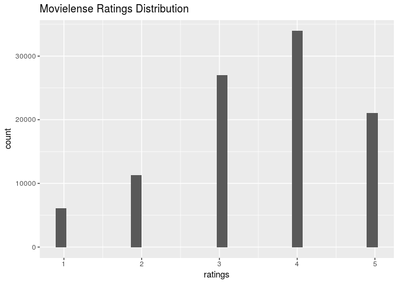

# RecommenderLab Tutorial
Brandon Hoeft  
October 6, 2017  


## Introduction

This is an introduction to building Recommender Systems using R. The major CRAN approved package available in R with developed algorithms is called `recommenderlab` by Michael Hahsler. Latest [documentation](https://cran.r-project.org/web/packages/recommenderlab/recommenderlab.pdf) and a [vignette](https://cran.r-project.org/web/packages/recommenderlab/vignettes/recommenderlab.pdf) are both available for exploration. The code examples provided in this exploratory analysis came primarily through the material on Collaborative Filtering algorithms from this package, explored in the book [*Building a Recommendation System with R*](https://smile.amazon.com/Building-Recommendation-System-Suresh-Gorakala/dp/1783554495/ref=sr_1_1?ie=UTF8&qid=1507314554&sr=8-1&keywords=building+a+recommendation+system+R), by Suresh K. Gorakala and Michele Usuelli. 

## Collaborative Filtering

The focus of this analysis will center around [*collaborative filtering*](https://en.wikipedia.org/wiki/Collaborative_filtering), one of the earliest forms of recommendation systems. The earliest developed forms of these algorithms are also known as *neighborhood based* or *memory based* algorithms, described below. If using machine learning or statistical model methods, they're referred to as *model based* algorithms. The basic idea of collaborative filtering is that given a large database of ratings profiles for individual users on what they rated/purchased, we can impute or predict ratings on items not rated/purchased by them, forming the basis of recommendation scores or top-N recommended items. 

Under *user-based collaborative filtering*, this memory-based method works under the assumption that users with similar item tastes will rate items similarly. Therefore, the missing ratings for a user can be predicted by finding other similar users (a neighborhood). Within the neighborhood, we can aggregate the ratings of these neighbors on items unknown to the user, as basis for a prediction.

An inverted approach to nearest neighbor based recommendations is *item-based collaborative filtering*. Instead of finding the most similar users to each individual, an algorithm assesses the similarities between the items that are correlated in their ratings or purchase profile amongst all users. 

Some additional starter articles to learning more about collaborative filtering can be found [here](https://www.ibm.com/developerworks/library/os-recommender1/) and here(http://recommender-systems.org/collaborative-filtering/). 

## Load recommenderlab

Let's load the package and explore some of the datasets included in it. Recommenderlab is implemented using classes in the **S4** class system, so it's notation is a little different from most `r` packages, which are often written using the **S3** object class system. 


```r
library(dplyr)
library(ggplot2)
library(recommenderlab)
```

Some of the preloaded datasets that come with `recommenderlab` for learning and exploring. 


```r
help(package = "recommenderlab")
datasets_available <- data(package = "recommenderlab")
datasets_available$results[,4] # titles
```

```
[1] "Jester dataset (5k sample)"               
[2] "Jester dataset (5k sample)"               
[3] "Anonymous web data from www.microsoft.com"
[4] "MovieLense Dataset (100k)"                
[5] "MovieLense Dataset (100k)"                
```

We'll work with the already available *Movielense* dataset.


```r
data(MovieLense) # loads dataset
class(MovieLense)
```

```
[1] "realRatingMatrix"
attr(,"package")
[1] "recommenderlab"
```

```r
movie_r <- MovieLense 
remove(MovieLense)
```

It is formatted as a `realRatingMatrix` class already, an object class created within `recommenderlab` for efficient storage of user-item ratings matrices. It's been optimized for storing sparse matrices, where almost all of the elements are empty. As an example, compare the object size of *Movielense* as a `realRatingMatrix` vs. a `matrix`. 


```r
library(pryr)
object_size(movie_r)
```

```
1.39 MB
```

```r
object_size(as(movie_r, "matrix"))
```

```
12.7 MB
```

The `realRatingMatrix` for this particular dataset is about 9 times more efficient in conserving memory than a traditional matrix object.

Some of the different functions that can be applied to the `realRatingMatrix` are: 


```r
methods(class = "realRatingMatrix")
```

```
 [1] binarize               calcPredictionAccuracy coerce                
 [4] colCounts              colMeans               colSds                
 [7] colSums                denormalize            dimnames<-            
[10] dimnames               dim                    dissimilarity         
[13] evaluationScheme       getData.frame          getList               
[16] getNormalize           getRatingMatrix        getRatings            
[19] getTopNLists           image                  normalize             
[22] nratings               [                      [<-                   
[25] Recommender            removeKnownRatings     rowCounts             
[28] rowMeans               rowSds                 rowSums               
[31] sample                 show                   similarity            
see '?methods' for accessing help and source code
```

## Explore the Movielense data

Some initial information about the dimensions and ratings count within Movielense matrix. 


```
943 x 1664 rating matrix of class 'realRatingMatrix' with 99392 ratings.
```

A preview of the first 25 users (rows of matrix) shows their count of movie ratings out of the 1664 available movies in the dataset. 


```
  1   2   3   4   5   6   7   8   9  10  11  12  13  14  15  16  17  18 
271  61  51  23 175 208 400  59  22 184 180  51 630  98 103 140  28 277 
 19  20  21  22  23  24  25 
 19  48 177 127 151  68  78 
```

Let's preview some of the movies rated by User #1. User 1's given an average rating of 3.61.


```
                                    Toy Story (1995) 
                                                   5 
                                    GoldenEye (1995) 
                                                   3 
                                   Four Rooms (1995) 
                                                   4 
                                   Get Shorty (1995) 
                                                   3 
                                      Copycat (1995) 
                                                   3 
Shanghai Triad (Yao a yao yao dao waipo qiao) (1995) 
                                                   5 
                               Twelve Monkeys (1995) 
                                                   4 
                                         Babe (1995) 
                                                   1 
                             Dead Man Walking (1995) 
                                                   5 
                                  Richard III (1995) 
                                                   3 
```

The following histogram shows the distribution of all the movie ratings in the dataset.

<!-- -->

```
   Min. 1st Qu.  Median    Mean 3rd Qu.    Max. 
   1.00    3.00    4.00    3.53    4.00    5.00 
```

## Strengs & Weaknesses

* *Data Requirements*: a user ratings profile, containing items they’ve rated/clicked/purchased. A "rating" can be defined however it fits the business use case.
        	
* *Strengths*: simple to implement, and recommendations are easy to explain to user. Transparency about the recommendation to a user can be a great boost to the user's confidence in trusting a rating. 
 
* *Weaknesses*: these algorithms do not too work well on very sparse ratings matrices. Additionally, they are computationally expensive as the entire user database needs to be processed as the basis of forming recommendations. These algorithms will not work from a cold start since a new user has no historic data profile or ratings for the algorithm to start from. 
