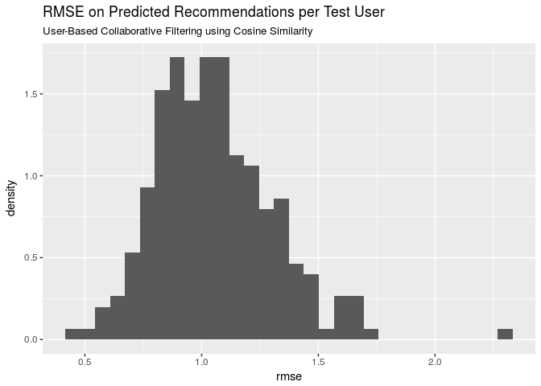

# RecommenderLab Tutorial
Brandon Hoeft  
October 6, 2017  


## Introduction

This is an introduction to building Recommender Systems using R. The major CRAN approved package available in R with developed algorithms is called `recommenderlab` by Michael Hahsler. Latest [documentation](https://cran.r-project.org/web/packages/recommenderlab/recommenderlab.pdf) and a [vignette](https://cran.r-project.org/web/packages/recommenderlab/vignettes/recommenderlab.pdf) are both available for exploration. The code examples provided in this exploratory analysis came primarily through the material on Collaborative Filtering algorithms from this package, explored in the book [*Building a Recommendation System with R*](https://smile.amazon.com/Building-Recommendation-System-Suresh-Gorakala/dp/1783554495/ref=sr_1_1?ie=UTF8&qid=1507314554&sr=8-1&keywords=building+a+recommendation+system+R), by Suresh K. Gorakala and Michele Usuelli. 

## Collaborative Filtering

The focus of this analysis will center around [*collaborative filtering*](https://en.wikipedia.org/wiki/Collaborative_filtering), one of the earliest forms of recommendation systems. The earliest developed forms of these algorithms are also known as *neighborhood based* or *memory based* algorithms, described below. If using machine learning or statistical model methods, they're referred to as *model based* algorithms. The basic idea of collaborative filtering is that given a large database of ratings profiles for individual users on what they rated/purchased, we can impute or predict ratings on items not rated/purchased by them, forming the basis of recommendation scores or top-N recommended items. 

Under *user-based collaborative filtering*, this memory-based method works under the assumption that users with similar item tastes will rate items similarly. Therefore, the missing ratings for a user can be predicted by finding other similar users (a neighborhood). Within the neighborhood, we can aggregate the ratings of these neighbors on items unknown to the user, as basis for a prediction. We'll explore this one in detail in sections below.

An inverted approach to nearest neighbor based recommendations is *item-based collaborative filtering*. Instead of finding the most similar users to each individual, an algorithm assesses the similarities between the items that are correlated in their ratings or purchase profile amongst all users. 

Some additional starter articles to learning more about collaborative filtering can be found [here](https://www.ibm.com/developerworks/library/os-recommender1/) and here(http://recommender-systems.org/collaborative-filtering/). 

## Load recommenderlab

Let's load the package and explore some of the datasets included in it. Recommenderlab is implemented using classes in the **S4** class system, so it's notation is a little different from most `r` packages, which are often written using the **S3** object class system. 


Some of the preloaded datasets that come with `recommenderlab` for learning and exploring. 


```
[1] "Jester dataset (5k sample)"               
[2] "Jester dataset (5k sample)"               
[3] "Anonymous web data from www.microsoft.com"
[4] "MovieLense Dataset (100k)"                
[5] "MovieLense Dataset (100k)"                
```

We'll work with the already available *Movielense* dataset.


```
[1] "realRatingMatrix"
attr(,"package")
[1] "recommenderlab"
```

It is formatted as a `realRatingMatrix` class already, an object class created within `recommenderlab` for efficient storage of user-item ratings matrices. It's been optimized for storing sparse matrices, where almost all of the elements are empty. As an example, compare the object size of *Movielense* as a `realRatingMatrix` vs. a `matrix`. 


```
1.39 MB
```

```
12.7 MB
```

The `realRatingMatrix` for this particular dataset is about 9 times more efficient in conserving memory than a traditional matrix object.

Some of the different functions that can be applied to the `realRatingMatrix` are: 


```
 [1] binarize               calcPredictionAccuracy coerce                
 [4] colCounts              colMeans               colSds                
 [7] colSums                denormalize            dimnames<-            
[10] dimnames               dim                    dissimilarity         
[13] evaluationScheme       getData.frame          getList               
[16] getNormalize           getRatingMatrix        getRatings            
[19] getTopNLists           image                  normalize             
[22] nratings               [                      [<-                   
[25] Recommender            removeKnownRatings     rowCounts             
[28] rowMeans               rowSds                 rowSums               
[31] sample                 show                   similarity            
see '?methods' for accessing help and source code
```

## Exploratory Analysis of the Movielense data

Some initial information about the dimensions and ratings count within Movielense matrix. 


```
943 x 1664 rating matrix of class 'realRatingMatrix' with 99392 ratings.
```

A preview of the first 10 users (rows of matrix) shows their count of movie ratings out of the 1664 available movies in the dataset. 


```
  1   2   3   4   5   6   7   8   9  10 
271  61  51  23 175 208 400  59  22 184 
```

Below is a preview of the ratings matrix of users and their ratings. Rows represent the user indexes.


```
10 x 4 sparse Matrix of class "dgCMatrix"
   Toy Story (1995) GoldenEye (1995) Four Rooms (1995) Get Shorty (1995)
1                 5                3                 4                 3
2                 4                .                 .                 .
3                 .                .                 .                 .
4                 .                .                 .                 .
5                 4                3                 .                 .
6                 4                .                 .                 .
7                 .                .                 .                 5
8                 .                .                 .                 .
9                 .                .                 .                 .
10                4                .                 .                 4
```


For a particular user such as User 1, they gave an average rating of 3.61. 10 of the movies rated by them are shown below. 


The `getRatings` function returns the non-missing ratings values from the matrix as a numeric vector. The following histogram shows the distribution of all movie ratings in the dataset. We can see that ratings typically skew higher, centered around a median rating of 4. 


```r
summary(getRatings(movie_r))
```

```
   Min. 1st Qu.  Median    Mean 3rd Qu.    Max. 
   1.00    3.00    4.00    3.53    4.00    5.00 
```

```r
data.frame(ratings = getRatings(movie_r)) %>%
  ggplot(aes(ratings)) + geom_bar(width = 0.75) +
    labs(title = 'Movielense Ratings Distribution')
```

<!-- -->

Using our `realRatingMatrix` object, we can also extract row counts to visualize distributions of the number of reviews given by each user. Below, the density is plotted along the y-axis instead of the raw counts, to give an idea of the the proportional frequency of each unit of each discrete bin in relation to the whole data set. The overall right-skewed distribution is indicative that most reviewers give very few overall reviews. 

In terms of understanding the density values, this histogram has bin-width set to 20; with a density of close to 0.01125 for the first bin, the tallest bar this bin represents approximately 0.01125 x 10 units per bin = 0.225 total proportion of the individual reviewers in the data. In other words, 22.5% of the 943 in the data have given fewer than 10 reviews. 


```
   Min. 1st Qu.  Median    Mean 3rd Qu.    Max. 
   19.0    32.0    64.0   105.4   147.5   735.0 
```

<!-- -->

Additionally, we can take a look at the average number of ratings given per each of the 1664 movies. Again, the right-skewed distribution here is indicative that the majority of films in the dataset are scarcely reviewed and there are a handful of movies with very high reviews, probably reflecting those films in the dataset with mass commercial appeal. 

With a median number of reviews of 27 per user and 1664 different movies available to rate, we know that the data is sparse with a lot of users not having rated most of the movies available. 


```
   Min. 1st Qu.  Median    Mean 3rd Qu.    Max. 
   1.00    7.00   27.00   59.73   80.00  583.00 
```

<!-- -->

**Can also visually explore summary(rowMeans(movie_r)) for average rating given per user.**

**Can also visually explore summary(colMeans(movie_r)) for average rating given per movie.**

## Recommender Algorithms Available

The recommender algorithms are stored in a registry object called `recommenderRegistry`. We can get a look at the different models based on the different matrix types.


```
 [1] "ALS_realRatingMatrix"            "ALS_implicit_realRatingMatrix"  
 [3] "ALS_implicit_binaryRatingMatrix" "AR_binaryRatingMatrix"          
 [5] "IBCF_binaryRatingMatrix"         "IBCF_realRatingMatrix"          
 [7] "POPULAR_binaryRatingMatrix"      "POPULAR_realRatingMatrix"       
 [9] "RANDOM_realRatingMatrix"         "RANDOM_binaryRatingMatrix"      
[11] "RERECOMMEND_realRatingMatrix"    "SVD_realRatingMatrix"           
[13] "SVDF_realRatingMatrix"           "UBCF_binaryRatingMatrix"        
[15] "UBCF_realRatingMatrix"          
```

Since our matrix is a real ratings matrix, we'll call the algorithms available for working on numeric ratings based review data as stored in the `realRatingMatrix`. Here, I've pulled the descriptions of each of the algorithms available for working with real user ratings data. 


```
                                                                                          ALS_realRatingMatrix 
"Recommender for explicit ratings based on latent factors, calculated by alternating least squares algorithm." 
                                                                                 ALS_implicit_realRatingMatrix 
   "Recommender for implicit data based on latent factors, calculated by alternating least squares algorithm." 
                                                                                         IBCF_realRatingMatrix 
                                                    "Recommender based on item-based collaborative filtering." 
                                                                                      POPULAR_realRatingMatrix 
                                                                       "Recommender based on item popularity." 
                                                                                       RANDOM_realRatingMatrix 
                                                              "Produce random recommendations (real ratings)." 
                                                                                  RERECOMMEND_realRatingMatrix 
                                                            "Re-recommends highly rated items (real ratings)." 
                                                                                          SVD_realRatingMatrix 
                                         "Recommender based on SVD approximation with column-mean imputation." 
                                                                                         SVDF_realRatingMatrix 
                                                        "Recommender based on Funk SVD with gradient descend." 
                                                                                         UBCF_realRatingMatrix 
                                                    "Recommender based on user-based collaborative filtering." 
```

## Exploring User-based Collaborative Filtering

In the algorithms registry, the last algorithm provided in the listing is the one we'll use to explore user-based collaborative filtering (UBCF) to fit the UBCF algorithm to the `realRatingMatrix` of MovieLense reviews data. Information about this algorithm per the registry:


```r
ubcf_model_description <- tail(recommenderRegistry$get_entries(dataType = "realRatingMatrix"), 1)
ubcf_model_description
```

```
$UBCF_realRatingMatrix
Recommender method: UBCF for realRatingMatrix
Description: Recommender based on user-based collaborative filtering.
Reference: NA
Parameters:
    method nn sample normalize
1 "cosine" 25  FALSE  "center"
```

There are 4 parameters to account for with this model as described above:

* **method**: this is the type of similarity metric to calculate similarity between users real ratings profile. Cosine similarity, Pearson correlation coefficient, and Jaccard similarity are available options. The first two are not good options if using unary ratings, but work well for this scenario.

* **nn**: this parameter sets the neighborhood of most similar users to consider for each user profile. the ratings profiles of the k nearest neighbors will be the basis for making predictions on a users unrated items profile.

* **sample**: a logical value to indicate whether the data should be sampled for train/test. Probably best to explicitely set a reproducible seed and sample the data before running the model.

* **normalize**: how to normalize real ratings provided by different users. This is crucially important b/c all users have a different bias in how they tend to rate items. This can be done by passing a value to this parameter inside the algorithm or applied to the matrix before any modeling too. See `?normalize` for additional details. 

### Normalize the data 

Since we're working with explicit real ratings of users, we need to acocunt for individual row bias of each user and make sure that all ratings are scaled similarly. The implication of not doing this could be potentially disasterous on new predicted ratings for any given user, dependent upon the different ratings bias of their k nearest neighbors. 

User rating *zero mean centering* will be used for modeling, where each user's vector of ratings is subtracted by its own mean to center the mean at zero. Z-scoring is an alternative method available too that additionally divides each user's rating by its standard deviation. 

** maybe visualize the distribution of user ratings here too after normalization vs. before normalization **


### How the UBCF algorithm works

1. Using [cosine similarity](https://en.wikipedia.org/wiki/Cosine_similarity), figure out how similar each user is to each other. 
  i) for each user, identify the *k* most similar users. Here, *k* parameter was the 10 most similar users who rated common items most similarly. 
2. Per item, average the ratings by each user's *k* most similar users.
  i) weight the average ratings based on similarity score of each user whose rated the item. Similarity score equals weight, or
  ii) use any of the pythagorean averages, as suits the business case (arithmetic, geometric, harmonic)
3. Select a Top-N recommendations threshold. 


###  Set Up a Model Training & Evaluation Scheme

The next step is to set up a model training and testing scheme. There are many ways to go about doing this. The simplest is to build the recommender on a subset of training records, and test the model on a different subset of testing records that were withheld from the modeling process. We'll use the `evaluationScheme` function within `recommenderLab`.


```r
train_proportion <- .75
# shouldn't keep n rec. items > min(rowCounts(movie_r))
min(rowCounts(movie_r))
```

```
[1] 19
```

```r
items_per_test_user_keep <- 10
# What's a good rating for a binary split?
good_threshold <- 4
```

The first thing to do is prepare the data, and set parameters for how the recommender algorithm will train the model. The scheme has been setup to use a single test dataset, train the data on a 75% random sample of the data. In the test set,  
10 items per user will be given to the recommender algorithm and the remaining test user's items will be held out for computing rating prediction error.


```r
# Building a Recommender System with R by Gorakala and Usuelli. Ch.4 pp 77 - 83
set.seed(123)
model_train_scheme <- movie_r %>%
  evaluationScheme(method = 'split', # single train/test split
                   train = train_proportion, # proportion of rows to train.
                   given = items_per_test_user_keep, # shouldn't keep n rec. items > min(rowCounts(movie_r))
                   goodRating = good_threshold, # for binary classifier analysis.
                   k = 1)
```

Having set our `evaluationScheme` and stored it in an object called *model_train_scheme*, we can fit a UBCF recommender system model. 


```r
# Building a Recommender System with R by Gorakala and Usuelli. Ch.4 pp 84
model_params <- list(method = "cosine",
                     nn = 10, # find each user's 10 most similar users.
                     sample = FALSE, # already did this.
                     normalize = "center")

model1 <- getData(model_train_scheme, "train") %>% #only fit on the 75% training data.
  Recommender(method = "UBCF", parameter = model_params)
```

### Evaluate Predictive Performance 

Having built the model, next step is to use the holdout testing data to evaluate the model's performance. The `getData` gives us access to different datasets in the model training scheme. We used the *train* data to build the model. There is also *known* and *unknown* test data available for evaluation. The *known* portion returns the specified 10 items per test user to give to the recommender algorithm. These *known* records per test user are withheld from predicting test performance; instead they are used to calibrate the test user's similarity to the trained records, identify and weight its nearest *k* neighbors, and then make item ratings or recommendation predictions. The predicted ratings or recommended items from these *known* data points per test user are compared to the remaining hidden items for each test user These *unknown* test user items therefore will be used to compute prediction error of the model. 

Since testing the algorithm with new data requires a known battery of item ratings to calibrate each test user and make recommendations on new items, and an unknown portion of ratings that can be used to calculate prediction error of these resulting recommendations, it's important that the *given* parameter is less than the minimum number of rated items available per user, so that *unknown* test data is available for every test case to measure prediction error of ratings. 

Next, we use the *known* part of the test users' item data (10 items for each user) to make predicted ratings for new items of the test user that were hidden from the algorithm. We can also predict top N items instead of the ratings if that is preferred. 


```r
# 5.5 - 5.6. Evaluation of predicted ratings in recommenderLab vignette. can use n = for predicting TopN or type = for predicting ratings.
# https://cran.r-project.org/web/packages/recommenderlab/vignettes/recommenderlab.pdf
model1_pred <- predict(model1, getData(model_train_scheme, "known"), type = "ratings")
model1_pred
```

```
236 x 1664 rating matrix of class 'realRatingMatrix' with 390344 ratings.
```

Now we can test the predicion error of model 1 on the *unknown* test user ratings using the `calcPredictionAccuracy` method. Three metrics for ratings test error are available: root mean squared error, mean squared error, or mean absolute error. The results below focus on RMSE with the errors calculated per test user on their *unknown* data. 


```r
test_error <- calcPredictionAccuracy(model1_pred, getData(model_train_scheme, "unknown"), byUser = TRUE)
head(test_error)
```

```
        RMSE       MSE       MAE
2  0.9794861 0.9593930 0.7870203
3  1.5874038 2.5198508 1.2496836
4  0.9952092 0.9904414 0.8355069
10 0.5706080 0.3255935 0.4573228
12 0.8180257 0.6691661 0.6573510
13 1.5663567 2.4534733 1.2803719
```

Let's visualize the distribution of the average RMSE of new predicted ratings for each 236 test user.

<!-- -->

## Additional Aspects to Explore not yet Covered

* In addition to fitting and testing a single model, this process can be repeated for different UBCF methods too. Candidate models can be evaluated based on the best RMSE for test users. Once a final model is selected, it can be fit on the entire dataset and used to make new recommendations going forward. 

* Another aspect to explore is item based collaborative filtering (IBCF), which can generate similar predictions to UBCF methods. It will be interesting to see which one performs better on the other. 

* Additionally, knowing the ** Top N ** recommendations may be more important than predicting a rating. The predicted ratings themselves could technically be sorted in descending order and ranked. However, this can be done more explicitely in the modeling process by using a cutoff value for a good rating threshold, building a ** Top N ** recommender model, and seeing how many good rated items from the *unknown* test user data that the model can identify. This becomes more of a traditional classification problem where ROC curves and analysis of True positives, False Positives, False Negatives, and True Negative recommendations can be analyzed. See section 5.7 (p.26) of the `recommenderLab` [vignette](https://cran.r-project.org/web/packages/recommenderlab/vignettes/recommenderlab.pdf) for details. 

## Strengs & Weaknesses of Neighborhood Methods

From my initial learning about collaborative filtering methods so far, some of my current understanding on their strengths, weaknesses, and data input requirements. 

* *Strengths*: simple to implement, and recommendations are easy to explain to user. Transparency about the recommendation to a user can be a great boost to the user's confidence in trusting a rating. 
 
* *Weaknesses*: these algorithms do not too work well on very sparse ratings matrices. Additionally, they are computationally expensive as the entire user database needs to be processed as the basis of forming recommendations. These algorithms will not work from a cold start since a new user has no historic data profile or ratings for the algorithm to start from. 

* *Data Requirements*: a user ratings profile, containing items they’ve rated/clicked/purchased. A "rating" can be defined however it fits the business use case.


