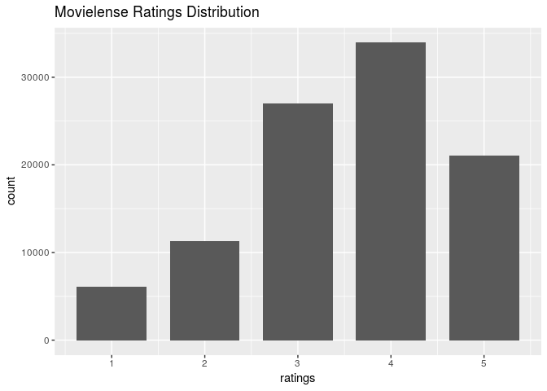

# RecommenderLab Tutorial
Brandon Hoeft  
October 6, 2017  


## Introduction

This is an introduction to building Recommender Systems using R. The major CRAN approved package available in R with developed algorithms is called `recommenderlab` by Michael Hahsler. Latest [documentation](https://cran.r-project.org/web/packages/recommenderlab/recommenderlab.pdf) and a [vignette](https://cran.r-project.org/web/packages/recommenderlab/vignettes/recommenderlab.pdf) are both available for exploration. The code examples provided in this exploratory analysis came primarily through the material on Collaborative Filtering algorithms from this package, explored in the book [*Building a Recommendation System with R*](https://smile.amazon.com/Building-Recommendation-System-Suresh-Gorakala/dp/1783554495/ref=sr_1_1?ie=UTF8&qid=1507314554&sr=8-1&keywords=building+a+recommendation+system+R), by Suresh K. Gorakala and Michele Usuelli. 

## Collaborative Filtering

The focus of this analysis will center around [*collaborative filtering*](https://en.wikipedia.org/wiki/Collaborative_filtering), one of the earliest forms of recommendation systems. The earliest developed forms of these algorithms are also known as *neighborhood based* or *memory based* algorithms, described below. If using machine learning or statistical model methods, they're referred to as *model based* algorithms. The basic idea of collaborative filtering is that given a large database of ratings profiles for individual users on what they rated/purchased, we can impute or predict ratings on items not rated/purchased by them, forming the basis of recommendation scores or top-N recommended items. 

Under *user-based collaborative filtering*, this memory-based method works under the assumption that users with similar item tastes will rate items similarly. Therefore, the missing ratings for a user can be predicted by finding other similar users (a neighborhood). Within the neighborhood, we can aggregate the ratings of these neighbors on items unknown to the user, as basis for a prediction.

An inverted approach to nearest neighbor based recommendations is *item-based collaborative filtering*. Instead of finding the most similar users to each individual, an algorithm assesses the similarities between the items that are correlated in their ratings or purchase profile amongst all users. 

Some additional starter articles to learning more about collaborative filtering can be found [here](https://www.ibm.com/developerworks/library/os-recommender1/) and here(http://recommender-systems.org/collaborative-filtering/). 

## Load recommenderlab

Let's load the package and explore some of the datasets included in it. Recommenderlab is implemented using classes in the **S4** class system, so it's notation is a little different from most `r` packages, which are often written using the **S3** object class system. 


Some of the preloaded datasets that come with `recommenderlab` for learning and exploring. 


```
[1] "Jester dataset (5k sample)"               
[2] "Jester dataset (5k sample)"               
[3] "Anonymous web data from www.microsoft.com"
[4] "MovieLense Dataset (100k)"                
[5] "MovieLense Dataset (100k)"                
```

We'll work with the already available *Movielense* dataset.


```
[1] "realRatingMatrix"
attr(,"package")
[1] "recommenderlab"
```

It is formatted as a `realRatingMatrix` class already, an object class created within `recommenderlab` for efficient storage of user-item ratings matrices. It's been optimized for storing sparse matrices, where almost all of the elements are empty. As an example, compare the object size of *Movielense* as a `realRatingMatrix` vs. a `matrix`. 


```
1.39 MB
```

```
12.7 MB
```

The `realRatingMatrix` for this particular dataset is about 9 times more efficient in conserving memory than a traditional matrix object.

Some of the different functions that can be applied to the `realRatingMatrix` are: 


```
 [1] binarize               calcPredictionAccuracy coerce                
 [4] colCounts              colMeans               colSds                
 [7] colSums                denormalize            dimnames<-            
[10] dimnames               dim                    dissimilarity         
[13] evaluationScheme       getData.frame          getList               
[16] getNormalize           getRatingMatrix        getRatings            
[19] getTopNLists           image                  normalize             
[22] nratings               [                      [<-                   
[25] Recommender            removeKnownRatings     rowCounts             
[28] rowMeans               rowSds                 rowSums               
[31] sample                 show                   similarity            
see '?methods' for accessing help and source code
```

## Exploratory Analysis of the Movielense data

Some initial information about the dimensions and ratings count within Movielense matrix. 


```
943 x 1664 rating matrix of class 'realRatingMatrix' with 99392 ratings.
```

A preview of the first 25 users (rows of matrix) shows their count of movie ratings out of the 1664 available movies in the dataset. 


```
  1   2   3   4   5   6   7   8   9  10  11  12  13  14  15  16  17  18 
271  61  51  23 175 208 400  59  22 184 180  51 630  98 103 140  28 277 
 19  20  21  22  23  24  25 
 19  48 177 127 151  68  78 
```

Below is a preview of the ratings matrix of users and their ratings. Rows represent the user indexes.


```
10 x 5 sparse Matrix of class "dgCMatrix"
   Toy Story (1995) GoldenEye (1995) Four Rooms (1995) Get Shorty (1995)
1                 5                3                 4                 3
2                 4                .                 .                 .
3                 .                .                 .                 .
4                 .                .                 .                 .
5                 4                3                 .                 .
6                 4                .                 .                 .
7                 .                .                 .                 5
8                 .                .                 .                 .
9                 .                .                 .                 .
10                4                .                 .                 4
   Copycat (1995)
1               3
2               .
3               .
4               .
5               .
6               .
7               .
8               .
9               .
10              .
```


Let's preview some of the movies rated by User #1. User 1's given an average rating of 3.61.


```
                                    Toy Story (1995) 
                                                   5 
                                    GoldenEye (1995) 
                                                   3 
                                   Four Rooms (1995) 
                                                   4 
                                   Get Shorty (1995) 
                                                   3 
                                      Copycat (1995) 
                                                   3 
Shanghai Triad (Yao a yao yao dao waipo qiao) (1995) 
                                                   5 
                               Twelve Monkeys (1995) 
                                                   4 
                                         Babe (1995) 
                                                   1 
                             Dead Man Walking (1995) 
                                                   5 
                                  Richard III (1995) 
                                                   3 
```

The `getRatings` function returns the non-missing ratings values from the matrix as a numeric vector. The following histogram shows the distribution of all movie ratings in the dataset. We can see that ratings typically skew higher, centered around a median rating of 4. 


```r
summary(getRatings(movie_r))
```

```
   Min. 1st Qu.  Median    Mean 3rd Qu.    Max. 
   1.00    3.00    4.00    3.53    4.00    5.00 
```

```r
data.frame(ratings = getRatings(movie_r)) %>%
  ggplot(aes(ratings)) + geom_bar(width = 0.75) +
    labs(title = 'Movielense Ratings Distribution')
```

<!-- -->

Using our `realRatingMatrix` object, we can also extract row counts to visualize distributions of the number of reviews given by each user. Below, the density is plotted along the y-axis instead of the raw counts, to give an idea of the the proportional frequency of each unit of each discrete bin in relation to the whole data set. The overall right-skewed distribution is indicative that most reviewers give very few overall reviews. 

In terms of understanding the density values, this histogram has bin-width set to 20; with a density of close to 0.01125 for the first bin, the tallest bar this bin represents approximately 0.01125 x 10 units per bin = 0.225 total proportion of the individual reviewers in the data. In other words, 22.5% of the 943 in the data have given fewer than 10 reviews. 


```r
summary(rowCounts(movie_r))
```

```
   Min. 1st Qu.  Median    Mean 3rd Qu.    Max. 
   19.0    32.0    64.0   105.4   147.5   735.0 
```

```r
rowCounts(movie_r) %>%
  data.frame(reviews_per_person = .) %>%
  ggplot(aes(x = reviews_per_person)) + 
    geom_histogram(aes(y = ..density..), binwidth = 20) +
    scale_y_continuous(limits = c(0,.0125), 
                       breaks = seq(0, .0125, by = 0.0025),
                       labels = seq(0, .0125, by = 0.0025)) +
    labs(title = 'Number of Ratings Per MovieLense Reviewer')
```

<!-- -->

Additionally, we can take a look at the average number of ratings given per each of the 1664 movies. Again, the right-skewed distribution here is indicative that the majority of films in the dataset are scarcely reviewed and there are a handful of movies with very high reviews, probably reflecting those films in the dataset with mass commercial appeal. 

With a median number of reviews of 27 per user and 1664 different movies available to rate, we know that the data is sparse with a lot of users not having rated most of the movies available. 


```r
summary(colCounts(movie_r))
```

```
   Min. 1st Qu.  Median    Mean 3rd Qu.    Max. 
   1.00    7.00   27.00   59.73   80.00  583.00 
```

```r
colCounts(movie_r) %>%
  data.frame(movie_review_count = .) %>%
  ggplot(aes(x = movie_review_count)) + 
    geom_histogram(aes(y = ..density..), binwidth = 20) +
    scale_y_continuous(limits = c(0,.0175)) +
    labs(title = 'Number of Reviews Per MovieLense listed Movie')
```

<!-- -->

**Can also visually explore summary(rowMeans(movie_r)) for average rating given per user.**

**Can also visually explore summary(colMeans(movie_r)) for average rating given per movie.**

## Recommender Algorithms Available

The recommender algorithms are stored in a registry object called `recommenderRegistry`. We can get a look at the different models based on the different matrix types.


```r
names(recommenderRegistry$get_entries())
```

```
 [1] "ALS_realRatingMatrix"            "ALS_implicit_realRatingMatrix"  
 [3] "ALS_implicit_binaryRatingMatrix" "AR_binaryRatingMatrix"          
 [5] "IBCF_binaryRatingMatrix"         "IBCF_realRatingMatrix"          
 [7] "POPULAR_binaryRatingMatrix"      "POPULAR_realRatingMatrix"       
 [9] "RANDOM_realRatingMatrix"         "RANDOM_binaryRatingMatrix"      
[11] "RERECOMMEND_realRatingMatrix"    "SVD_realRatingMatrix"           
[13] "SVDF_realRatingMatrix"           "UBCF_binaryRatingMatrix"        
[15] "UBCF_realRatingMatrix"          
```

Since our matrix is a real ratings matrix, we'll call the algorithms available for working on numeric ratings based review data as stored in the `realRatingMatrix`. Here, I've pulled the descriptions of each of the algorithms available for working with real user ratings data. 


```r
vapply(recommenderRegistry$get_entries(dataType = "realRatingMatrix"), 
       '[[', 
       FUN.VALUE = "character", 
       "description")
```

## Exploring User-based Collaborative Filtering

In the algorithms registry, the last algorithm provided in the listing is the one we'll use to explore user-based collaborative filtering (UBCF) to fit the UBCF algorithm to the `realRatingMatrix` of MovieLense reviews data. Information about this algorithm per the registry:


```
$UBCF_realRatingMatrix
Recommender method: UBCF for realRatingMatrix
Description: Recommender based on user-based collaborative filtering.
Reference: NA
Parameters:
    method nn sample normalize
1 "cosine" 25  FALSE  "center"
```

There are 4 parameters to account for with this model as described above:

* **method**: this is the type of similarity metric to calculate similarity between users real ratings profile. Cosine similarity, Pearson correlation coefficient, and Jaccard similarity are available options. The first two are not good options if using unary ratings, but work well for this scenario.

* **nn**: this parameter sets the neighborhood of most similar users to consider for each user profile. the ratings profiles of the k nearest neighbors will be the basis for making predictions on a users unrated items profile.

* **sample**: a logical value to indicate whether the data should be sampled for train/test. Probably best to explicitely set a reproducible seed and sample the data before running the model.

* **normalize**: how to normalize real ratings provided by different users. This is crucially important b/c all users have a different bias in how they tend to rate items. This can be done by passing a value to this parameter inside the algorithm or applied to the matrix before any modeling too. See `?normalize` for additional details. 

### Normalize the data 

Since we're working with explicit real ratings of users, we need to acocunt for individual row bias of each user and make sure that all ratings are scaled similarly. The implication of not doing this could be potentially disasterous on new predicted ratings for any given user, dependent upon the different ratings bias of their k nearest neighbors. 

Here, user rating *zero mean centering* is used, where each user's vector of ratings is subtracted by its own mean to center the mean at zero. Z-scoring is an alternative method available too that additionally divides each user's rating by its standard deviation. 

** maybe visualize the distribution of user ratings here too after normalization vs. before normalization **


### Split the data into Train & Test

So we can more objectively measure the performance of the UBCF recommender system, we will build it on a subset of training records, and test the model on a different subset of testing records that were withheld from the modeling process. 


```
[1] TRUE
```

### Fit the model on Training Data

Having zero mean centered each user's ratings to control for user bias, and splitting the data into model training and model testing partitions, time to fit a model. Parameters were tuned from defaults for illustrative purposes. 


```r
ubcf_model <- Recommender(train, method = "UBCF", 
                          parameter = list(method = "cosine",
                                           nn = 10, # find each user's 10 most similar users. 
                                           sample = FALSE, # already did this.
                                           normalize = NA)) # already did this. 
```

Now that we have a model, we can look at its metadata, such as the hyperparameters used to filter user recommendations. 


```r
getModel(ubcf_model)
```

```
$description
[1] "UBCF-Real data: contains full or sample of data set"

$data
661 x 1664 rating matrix of class 'realRatingMatrix' with 69133 ratings.
Normalized using center on rows.

$method
[1] "cosine"

$nn
[1] 10

$sample
[1] FALSE

$normalize
[1] NA

$verbose
[1] FALSE
```


## Strengs & Weaknesses of Neighborhood Methods

* *Data Requirements*: a user ratings profile, containing items they’ve rated/clicked/purchased. A "rating" can be defined however it fits the business use case.
        	
* *Strengths*: simple to implement, and recommendations are easy to explain to user. Transparency about the recommendation to a user can be a great boost to the user's confidence in trusting a rating. 
 
* *Weaknesses*: these algorithms do not too work well on very sparse ratings matrices. Additionally, they are computationally expensive as the entire user database needs to be processed as the basis of forming recommendations. These algorithms will not work from a cold start since a new user has no historic data profile or ratings for the algorithm to start from. 
